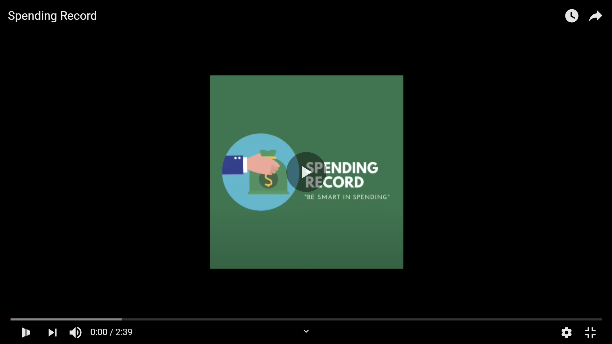

# Spending Record 
**Master :**  
   

Spending Record adalah aplikasi berbasis LINEBOT yang membantu pengguna dalam memantau pengeluaran keuangan.   
Aplikasi ini dibangun menggunakan beberapa konsep (penjelasan lebih detail dapat dilihat <a href="https://docs.google.com/presentation/d/1JoFtKwba-ioYWn7ki_9-tu-8cr3T_CS3dI6IQYCyfvI/edit#slide=id.p1">disini</a>), seperti : 
* Design Principle (Single Responsibility Principle dan Separation of Logic)
* Design Pattern (State Pattern dan DAO Pattern)
* Clean code, google checkstyle, dan unit testing
* Arsitektur monolitik
* Asynchronous Programming
* Profiling (menggunakan Jprofiler)
* Gitlab CI/CD  

##### Tambahkan Spending Record sebagai teman <a href="https://lin.ee/bvzXnRX "><b>disini</b></a>

## Author  
<a href="https://gitlab.com/adhytianara" >Adhytia Wana Putra</a>  
<a href="https://gitlab.com/ismailshalih_ak" >Ismail Shalih Abdul Kholiq</a>  
<a href="https://gitlab.com/ihsanazizi14" >Muhammad Ihsan Azizi</a>  
<a href="https://gitlab.com/nabilah.adani" >Nabilah Adani Nurulizzah</a>  
<a href="https://gitlab.com/DahlanYasa" >Muhammad Dahlan Yasadipura</a>  
## Fitur Bot  
**1. Catat Pengeluaran :**   
Mencatat pengeluaran ke dalam beberapa kategori seperti makanan, transportasi, dll.  

  
**2. Lihat Laporan :**  
Melihat hasil pencatatan dari masing-masing kategori.  

  
**3. Atur Budget :**  
Mengatur target pengeluaran yang ingin dicapai.  

  
**4. Sisa Budget :**  
Melihat sisa dari budget pengeluaran, serta dapat mengedit ulang budget pengeluaran.  

  
**5. Ingatkan Saya :**  
Mengirimkan pesan otomatis yang mengingatkan pengguna untuk mengisi pengeluaran.  

## Demo
Tonton videonya <a href="https://youtu.be/nQ4qDy5RfYY" ><b>disini</b></a>  

 
## Screenshot
Screenshot lebih lengkap dapat dilihat di dalam <a href="https://gitlab.com/TKAdpro11/SpendingRecord/-/tree/master/screenshot" >folder screenshot</a>
